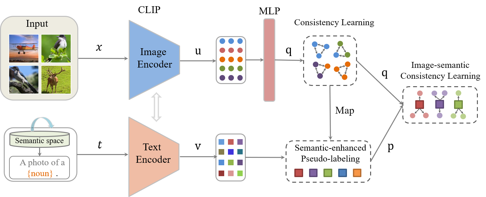

# Semantic-Enhanced Image Clustering (SIC)

This is the code for the paper "Semantic-Enhanced Image Clustering" (AAAI 2023)

<div align=center></div>

# Installation
- Step 1. Create a conda environment and activate it.
```shell
conda create --name SIC python=3.7
conda activate SIC
```
- Step 2. pip 
```shell
pip install -r requirement.txt
```

## Configuration

Save in the ''configs'' directory.

## Train && Test

After setting the configuration, to start training.

firstly, run knn.py to get knn indices.
> python knn.py --config_env  configs/env.yml --config_exp configs/clustering/scan_cifar10.yml

then, run 
> python sic.py --config_env  configs/env.yml --config_exp configs/clustering/scan_cifar10.yml


# Dataset

CIFAR-10, CIFAR-100, STL-10 will be automatically downloaded by Pytorch. Tiny-ImageNet can be downloaded from http://cs231n.stanford.edu/tiny-imagenet-200.zip. For ImageNet-10 and ImageNet-dogs, we provided their description in the "dataset" folder.

# Citation

If you find SIC useful in your research, please cite:
```
@inproceedings{cai2023semantic,
  title={Semantic-Enhanced Image Clustering},
  author={Cai, Shaotian and Qiu, Liping and Chen, Xiaojun and Zhang, Qin and Chen, Longteng},
  booktitle={Proceedings of the AAAI Conference on Artificial Intelligence},
  year = {2023}
}
```

